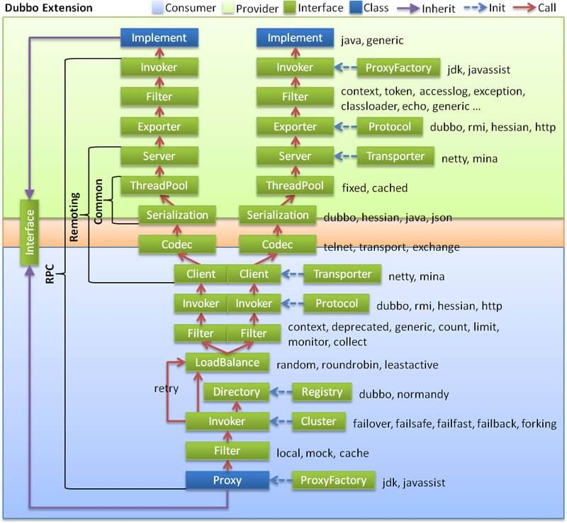
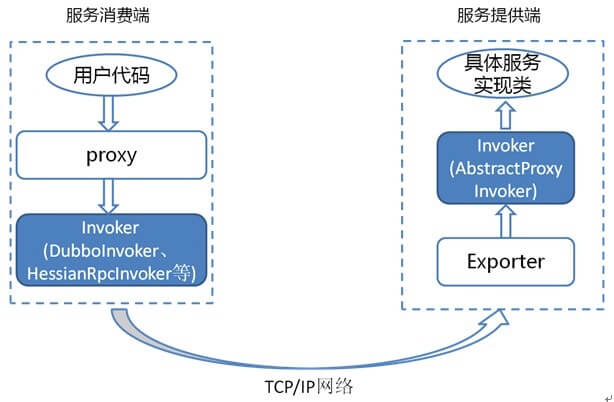
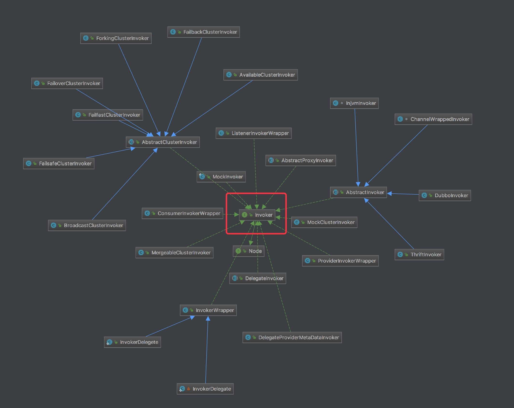
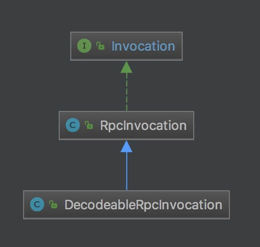
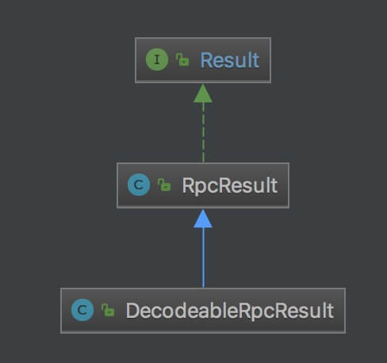
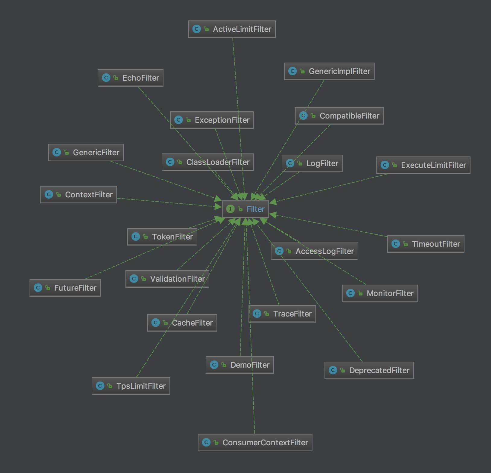
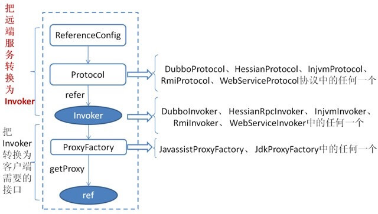
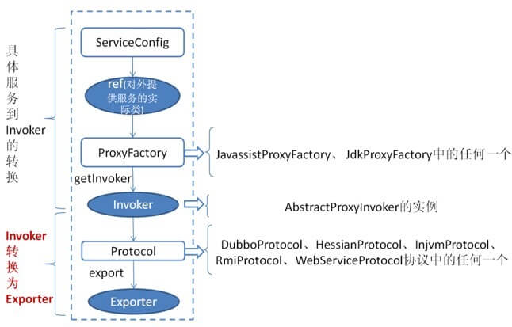
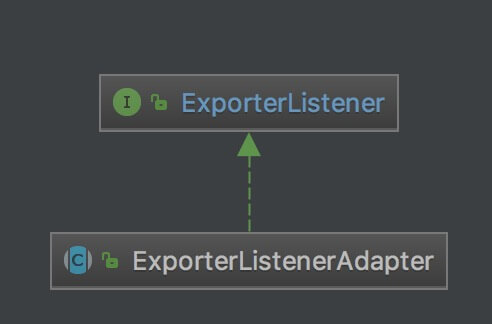

# 精尽 Dubbo 源码分析 —— 核心流程一览


# 1. 概述

本文主要分享 **Dubbo 的核心流程**。
希望通过本文能让胖友对 Dubbo 的核心流程有个简单的了解。

另外，笔者会相对**大量**引用 [《Dubbo 开发指南 —— 框架设计》](http://dubbo.apache.org/zh-cn/docs/dev/design.html) 和 [《Dubbo 开发指南 —— 实现细节》](http://dubbo.apache.org/zh-cn/docs/dev/implementation.html) ，写的真的挺好的。🙂 或者说，本文是该文章的**细化**和**解说**。
ps：限于排版，部分地方引用会存在未标明的情况。

# 2. 整体设计

> 😈 本小节，基本为引用 + 重新排版。

下面我们先来看看整体设计图，相对比较**复杂**：

> FROM [《Dubbo 开发指南 —— 框架设计》](http://dubbo.apache.org/zh-cn/docs/dev/)
> 

## 2.1 图例说明

> - 最顶上九个**图标**，代表本图中的对象与流程。
> - 图中左边 **淡蓝背景**( Consumer ) 的为服务消费方使用的接口，右边 **淡绿色背景**( Provider ) 的为服务提供方使用的接口，位于中轴线上的为双方都用到的接口。
> - 图中从下至上分为十层，各层均为**单向**依赖，右边的 **黑色箭头**( Depend ) 代表层之间的依赖关系，每一层都可以剥离上层被复用。其中，Service 和 Config 层为 API，其它各层均为 [SPI](http://blog.csdn.net/top_code/article/details/51934459) 。
> - 图中 **绿色小块**( Interface ) 的为扩展接口，**蓝色小块**( Class ) 为实现类，图中只显示用于关联各层的实现类。
> - 图中 **蓝色虚线**( Init ) 为初始化过程，即启动时组装链。**红色实线**( Call )为方法调用过程，即运行时调时链。**紫色三角箭头**( Inherit )为继承，可以把子类看作父类的同一个节点，线上的文字为调用的方法。

## 2.2 各层说明

> 友情提示：建议可以先阅读 [《精尽 Dubbo 源码分析 —— 项目结构一览》](http://svip.iocoder.cn/Dubbo/intro/?self) 文章。

- ==================== Business ====================

- **Service 业务层**：业务代码的接口与实现。我们实际使用 Dubbo

- ==================== RPC ====================

- config 配置层

  ：对外配置接口，以 ServiceConfig, ReferenceConfig 为中心，可以直接初始化配置类，也可以通过 Spring 解析配置生成配置类。

  - [`dubbo-config`](https://github.com/YunaiV/dubbo/tree/6de0a069fcc870894e64ffd54a24e334b19dcb36/dubbo-config) 模块实现。
  - 这层的代码，在 [《精尽 Dubbo 源码分析 —— API 配置》](http://svip.iocoder.cn/Dubbo/implementation-intro/#) 、[《精尽 Dubbo 源码分析 —— XML 配置》](http://svip.iocoder.cn/Dubbo/configuration-xml/?self) 等等文章，已经详细解析。

- proxy 服务代理层

  ：服务接口透明代理，生成服务的客户端 Stub 和服务器端 Skeleton,

   

  以 ServiceProxy 为中心

  ，扩展接口为 ProxyFactory 。

  - [`dubbo-rpc-rpc`](https://github.com/YunaiV/dubbo/tree/6de0a069fcc870894e64ffd54a24e334b19dcb36/dubbo-rpc) 模块实现。
  - [`com.alibaba.dubbo.rpc.proxy`](https://github.com/YunaiV/dubbo/tree/6de0a069fcc870894e64ffd54a24e334b19dcb36/dubbo-rpc/dubbo-rpc-api/src/main/java/com/alibaba/dubbo/rpc/proxy)包 + [`com.alibaba.dubbo.rpc.ProxyFactory`](https://github.com/YunaiV/dubbo/blob/6de0a069fcc870894e64ffd54a24e334b19dcb36/dubbo-rpc/dubbo-rpc-api/src/main/java/com/alibaba/dubbo/rpc/ProxyFactory.java)接口 。
  - 在 [「4.5 ProxyFactory」](http://svip.iocoder.cn/Dubbo/implementation-intro/#) 详细解析。

- registry

   

  注册中心层：封装服务地址的注册与发现，以服务 URL 为中心，扩展接口为 RegistryFactory, Registry, RegistryService 。

  - [`dubbo-registry`](https://github.com/alibaba/dubbo/tree/4bbc0ddddacc915ddc8ff292dd28745bbc0031fd/dubbo-registry) 模块实现。

- cluster 路由层

  ：封装多个提供者的路由及负载均衡，并桥接注册中心，以 Invoker 为中心，扩展接口为 Cluster, Directory, Router, LoadBalance 。

  - [`dubbo-cluster`](https://github.com/alibaba/dubbo/tree/4bbc0ddddacc915ddc8ff292dd28745bbc0031fd/dubbo-cluster) 模块实现。
  - 这层的代码，在 [《精尽 Dubbo 源码分析 —— 项目结构一览》「3.4 dubbo-cluster」](http://svip.iocoder.cn/Dubbo/intro/?self) 章节，有简单介绍。

- monitor 监控层

  ：RPC 调用次数和调用时间监控，以 Statistics 为中心，扩展接口为 MonitorFactory, Monitor, MonitorService 。

  - [`dubbo-monitor`](https://github.com/alibaba/dubbo/tree/4bbc0ddddacc915ddc8ff292dd28745bbc0031fd/dubbo-cluster) 模块实现。

- ==================== Remoting ====================

- protocol 远程调用层

  ：封将 RPC 调用，以 Invocation, Result 为中心，扩展接口为 Protocol, Invoker, Exporter 。

  - [`dubbo-rpc-rpc`](https://github.com/YunaiV/dubbo/tree/6de0a069fcc870894e64ffd54a24e334b19dcb36/dubbo-rpc) 模块实现。
  - [`com.alibaba.dubbo.rpc.protocol`](https://github.com/YunaiV/dubbo/tree/6de0a069fcc870894e64ffd54a24e334b19dcb36/dubbo-rpc/dubbo-rpc-api/src/main/java/com/alibaba/dubbo/rpc/protocol)包 + [`com.alibaba.dubbo.rpc.Protocol`](https://github.com/YunaiV/dubbo/blob/6de0a069fcc870894e64ffd54a24e334b19dcb36/dubbo-rpc/dubbo-rpc-api/src/main/java/com/alibaba/dubbo/rpc/ProxyFactory.java)接口 。
  - 在 [「4.6 Protocol」](http://svip.iocoder.cn/Dubbo/implementation-intro/#) 详细解析。

- exchange 信息交换层

  ：封装请求响应模式，同步转异步，以 Request, Response 为中心，扩展接口为 Exchanger, ExchangeChannel, ExchangeClient, ExchangeServer 。

  - [`dubbo-remoting-api`](https://github.com/YunaiV/dubbo/tree/6de0a069fcc870894e64ffd54a24e334b19dcb36/dubbo-remoting/dubbo-remoting-api) 模块定义接口。
  - [`com.alibaba.dubbo.remoting.exchange`](https://github.com/YunaiV/dubbo/blob/6de0a069fcc870894e64ffd54a24e334b19dcb36/dubbo-remoting/dubbo-remoting-api/src/main/java/com/alibaba/dubbo/remoting/exchange/)包。

- transport 网络传输层

  ：抽象 mina 和 netty 为统一接口，以 Message 为中心，扩展接口为 Channel, Transporter, Client, Server, Codec 。

  - [`dubbo-remoting-api`](https://github.com/YunaiV/dubbo/tree/6de0a069fcc870894e64ffd54a24e334b19dcb36/dubbo-remoting/dubbo-remoting-api) 模块定义接口。
  - [`com.alibaba.dubbo.remoting.transport`](https://github.com/YunaiV/dubbo/blob/6de0a069fcc870894e64ffd54a24e334b19dcb36/dubbo-remoting/dubbo-remoting-api/src/main/java/com/alibaba/dubbo/remoting/transport/)包。

- serialize 数据序列化层

  ：可复用的一些工具，扩展接口为 Serialization, ObjectInput, ObjectOutput, ThreadPool 。

  - [`dubbo-common`](https://github.com/YunaiV/dubbo/tree/6de0a069fcc870894e64ffd54a24e334b19dcb36/dubbo-common) 模块实现。
  - [`com.alibaba.dubbo.common.serialize`](https://github.com/YunaiV/dubbo/tree/6de0a069fcc870894e64ffd54a24e334b19dcb36/dubbo-common/src/main/java/com/alibaba/dubbo/common/serialize)包。

## 2.3 关系说明

> 在 RPC 中，Protocol 是核心层，也就是只要有 Protocol + Invoker + Exporter 就可以完成非透明的 RPC 调用，然后在 Invoker 的主过程上 Filter 拦截点。

- 解说：[`dubbo-rpc-rpc`](https://github.com/YunaiV/dubbo/tree/6de0a069fcc870894e64ffd54a24e334b19dcb36/dubbo-rpc) 模块即可**独立**完成该功能。

> **图中的 Consumer 和 Provider 是抽象概念**，只是想让看图者更直观的了解哪些类分属于客户端与服务器端，不用 Client 和 Server 的原因是 Dubbo 在很多场景下都使用 Provider, Consumer, Registry, Monitor 划分逻辑拓普节点，保持统一概念。

- x

> 而 Cluster 是外围概念，所以 Cluster 的目的是将多个 Invoker 伪装成一个 Invoker，这样其它人只要关注 Protocol 层 Invoker 即可，加上 Cluster 或者去掉 Cluster 对其它层都不会造成影响，因为只有一个提供者时，是不需要 Cluster 的。

- 解说：[`dubbo-cluster`](https://github.com/alibaba/dubbo/tree/4bbc0ddddacc915ddc8ff292dd28745bbc0031fd/dubbo-cluster) 模块提供的是**非必须**的功能。移除该模块，RPC 亦可正常运行。

> **Proxy 层**封装了所有接口的透明化代理，而在其它层都以 Invoker 为中心，只有到了暴露给用户使用时，才用 Proxy 将 Invoker 转成接口，或将接口实现转成 Invoker，也就是去掉 Proxy 层 RPC 是可以 Run 的，只是不那么透明，不那么看起来像调本地服务一样调远程服务。

- 解说：简单粗暴的说，Proxy 会**拦截** `service.doSomething(args)` 的调用，“转发”给该 Service 对应的 Invoker ，从而实现**透明化**的代理。

> 而 **Remoting** 实现是 Dubbo 协议的实现，如果你选择 RMI 协议，整个 Remoting 都不会用上。Remoting 内部再划为 Transport 传输层和 Exchange 信息交换层，**Transport 层**只负责单向消息传输，是对 Mina, Netty, Grizzly 的抽象，它也可以扩展 UDP 传输；而 **Exchange 层**是在传输层之上封装了 Request-Response 语义。

- x

> **Registry 和 Monitor** 实际上不算一层，而是一个独立的节点，只是为了全局概览，用层的方式画在一起。

- x

# 3. 核心流程

## 3.1 调用链

展开总设计图的**红色调用链**( Call )，如下：

> FROM [《Dubbo 开发指南 —— 框架设计》](http://dubbo.apache.org/zh-cn/docs/dev/)
> 

- 垂直分层如下：
  - 下方 **淡蓝背景**( Consumer )：服务消费方使用的接口
  - 上方 **淡绿色背景**( Provider )：服务提供方使用的接口
  - 中间 **粉色背景**( Remoting )：通信部分的接口
- 自 LoadBalance 向上，每一行分成了**多个**相同的 Interface ，指的是**负载均衡**后，向 Provider 发起调用。
- 左边 **括号** 部分，代表了垂直部分更**细化**的分层，依次是：Common、Remoting、RPC、Interface 。
- 右边 **蓝色虚线**( Init ) 为初始化过程，通过对应的组件进行初始化。例如，ProxyFactory 初始化出 Proxy 。

## 3.2 暴露服务

展开总设计图**左边**服务提供方暴露服务的**蓝色初始化链**( Init )，时序图如下：

> FROM [《Dubbo 开发指南 —— 框架设计》](http://dubbo.apache.org/zh-cn/docs/dev/)
> 

## 3.3 引用服务

展开总设计图**右边**服务消费方引用服务的**蓝色初始化链**( Init )，时序图如下：

> FROM [《Dubbo 开发指南 —— 框架设计》](http://dubbo.apache.org/zh-cn/docs/dev/)
> 

# 4. 领域模型

本小节分享的，在 [`dubbo-rpc-api`](https://github.com/YunaiV/dubbo/tree/6de0a069fcc870894e64ffd54a24e334b19dcb36/dubbo-rpc/dubbo-rpc-api) 目录中，如下图红框部分：


## 4.1 Invoker

[`com.alibaba.dubbo.rpc.Invoker`](https://github.com/YunaiV/dubbo/blob/6de0a069fcc870894e64ffd54a24e334b19dcb36/dubbo-rpc/dubbo-rpc-api/src/main/java/com/alibaba/dubbo/rpc/Invoker.java) 。

> Invoker 是实体域，它是 Dubbo 的核心模型，其它模型都向它靠扰，或转换成它。
> 它代表一个可执行体，可向它发起 invoke 调用。
> 它有可能是一个本地的实现，也可能是一个远程的实现，也可能一个集群实现。

代码如下：

```
public interface Invoker<T> extends Node {

    /**
     * get service interface.
     *
     * @return service interface.
     */
    Class<T> getInterface();

    /**
     * invoke.
     *
     * @param invocation
     * @return result
     * @throws RpcException
     */
    Result invoke(Invocation invocation) throws RpcException;

}
```

- `#getInterface()` 方法，获得 Service 接口。
- `#invoke(Invocation)` 方法，调用方法。

### 4.1.1 满眼都是 Invoker

下面，我们要引用 [《Dubbo 开发指南 —— 实现细节》](http://dubbo.apache.org/zh-cn/docs/dev/implementation.html#fn_5) 的 [**满眼都是 Invoker**](http://svip.iocoder.cn/Dubbo/implementation-intro/#) 小节的内容，来进一步理解 Invoker ：

由于 Invoker 是 Dubbo 领域模型中非常重要的一个概念，很多设计思路都是向它靠拢。
这就使得 Invoker 渗透在整个实现代码里，对于刚开始接触 Dubbo 的人，确实容易给搞混了。

下面我们用一个精简的图来说明最重要的两种 Invoker：服务提供 Invoker 和服务消费 Invoker：



为了更好的解释上面这张图，我们**结合服务消费和提供者的代码示例**来进行说明：

- 服务消费者代码：

  ```
  public class DemoClientAction {
  
      private DemoService demoService;
  
      public void setDemoService(DemoService demoService) {
          this.demoService = demoService;
      }
  
      public void start() {
          String hello = demoService.sayHello("world" + i);
      }
  }
  ```

  - 上面代码中的 DemoService 就是上图中服务消费端的 Proxy，用户代码通过这个 Proxy 调用其对应的 Invoker，而该 Invoker 实现了真正的远程服务调用。

- 服务提供者代码：

  ```
  public class DemoServiceImpl implements DemoService {
  
      public String sayHello(String name) throws RemoteException {
          return "Hello " + name;
      }
  }
  ```

  - 上面这个类会被封装成为一个 AbstractProxyInvoker 实例，并新生成一个 Exporter 实例。这样当网络通讯层收到一个请求后，会找到对应的 Exporter 实例，并调用它所对应的 AbstractProxyInvoker 实例，从而真正调用了服务提供者的代码。

*Dubbo 里还有一些其他的 Invoker 类，但上面两种是最重要的*。

### 4.1.2 类图

正如上文所说，Invoker 渗透在 Dubbo 的代码中，Invoker 的实现类也非常非常非常多，如下图：



后续我们会详细分析。

## 4.2 Invocation

[`com.alibaba.dubbo.rpc.Invocation`](https://github.com/YunaiV/dubbo/blob/6de0a069fcc870894e64ffd54a24e334b19dcb36/dubbo-rpc/dubbo-rpc-api/src/main/java/com/alibaba/dubbo/rpc/Invocation.java) 。

> Invocation 是会话域，它持有调用过程中的变量，比如方法名，参数等。

代码如下：

```
public interface Invocation {

    /**
     * get method name.
     *
     * @return method name.
     * @serial
     */
    String getMethodName();

    /**
     * get parameter types.
     *
     * @return parameter types.
     * @serial
     */
    Class<?>[] getParameterTypes();

    /**
     * get arguments.
     *
     * @return arguments.
     * @serial
     */
    Object[] getArguments();

    /**
     * get attachments.
     *
     * @return attachments.
     * @serial
     */
    Map<String, String> getAttachments();

    /**
     * get attachment by key.
     *
     * @return attachment value.
     * @serial
     */
    String getAttachment(String key);

    /**
     * get attachment by key with default value.
     *
     * @return attachment value.
     * @serial
     */
    String getAttachment(String key, String defaultValue);

    /**
     * get the invoker in current context.
     *
     * @return invoker.
     * @transient
     */
    Invoker<?> getInvoker();

}
```

- `#getMethodName()` 方法，获得方法名。

- `#getParameterTypes()` 方法，获得方法参数**类型**数组。

- `#getArguments()` 方法，获得方法参数数组。

- ```
  #getAttachments()
  ```

   

  等方法，获得隐式参数相关。

  - 不了解的胖友，可以看看 [《Dubbo 用户指南 —— 隐式参数》](http://dubbo.apache.org/zh-cn/docs/user/demos/attachment.html) 文档。
  - 和 HTTP Request **Header** 有些相似。

- `#getInvoker()` 方法，获得对应的 Invoker 对象。

### 4.2.1 类图



- `com.alibaba.dubbo.rpc.RpcInvocation`
  - 点击查看，比较容易理解。
- `com.alibaba.dubbo.rpc.protocol.dubbo.DecodeableRpcInvocation`
  - Dubbo 协议**独有**，后续文章分享。

## 4.3 Result

[`com.alibaba.dubbo.rpc.Result`](https://github.com/YunaiV/dubbo/blob/6de0a069fcc870894e64ffd54a24e334b19dcb36/dubbo-rpc/dubbo-rpc-api/src/main/java/com/alibaba/dubbo/rpc/Result.java) 。

Result 是会话域，它持有调用过程中返回值，异常等。

代码如下：

```
public interface Result {

    /**
     * Get invoke result.
     *
     * @return result. if no result return null.
     */
    Object getValue();

    /**
     * Get exception.
     *
     * @return exception. if no exception return null.
     */
    Throwable getException();

    /**
     * Has exception.
     *
     * @return has exception.
     */
    boolean hasException();

    /**
     * Recreate.
     * <p>
     * <code>
     * if (hasException()) {
     * throw getException();
     * } else {
     * return getValue();
     * }
     * </code>
     *
     * @return result.
     * @throws if has exception throw it.
     */
    Object recreate() throws Throwable;

    /**
     * get attachments.
     *
     * @return attachments.
     */
    Map<String, String> getAttachments();

    /**
     * get attachment by key.
     *
     * @return attachment value.
     */
    String getAttachment(String key);

    /**
     * get attachment by key with default value.
     *
     * @return attachment value.
     */
    String getAttachment(String key, String defaultValue);

}
```

- `#getValue()` 方法，获得返回值。

- ```
  #getException()
  ```

   

  方法，获得返回的异常。

  - `#hasException()` 方法，是否有异常。

- `#recreate()` 方法，实现代码如下：

  ```
  // RpcResult.java
  
  private Object result;
  
  private Throwable exception;
  
  public Object recreate() throws Throwable {
      if (exception != null) {
          throw exception;
      }
      return result;
  }
  ```

- `#getAttachments()` 等方法，获得**返回**的隐式参数相关。

  - 不了解的胖友，可以看看 [《Dubbo 用户指南 —— 隐式参数》](http://dubbo.apache.org/zh-cn/docs/user/demos/attachment.html) 文档。
  - 和 HTTP Response **Header** 有些相似。

### 4.3.1 类图



- `com.alibaba.dubbo.rpc.RpcResult`
  - 点击查看，比较容易理解。
- `com.alibaba.dubbo.rpc.protocol.dubbo.DecodeableRpcResult`
  - Dubbo 协议**独有**，后续文章分享。

## 4.4 Filter

[`com.alibaba.dubbo.rpc.Filter`](https://github.com/YunaiV/dubbo/blob/6de0a069fcc870894e64ffd54a24e334b19dcb36/dubbo-rpc/dubbo-rpc-api/src/main/java/com/alibaba/dubbo/rpc/Filter.java) 。

过滤器接口，和我们平时理解的 [`javax.servlet.Filter`](https://docs.oracle.com/javaee/5/api/javax/servlet/Filter.html) 基本一致。

代码如下：

```
public interface Filter {

    /**
     * do invoke filter.
     * <p>
     * <code>
     * // before filter
     * Result result = invoker.invoke(invocation);
     * // after filter
     * return result;
     * </code>
     *
     * @param invoker    service
     * @param invocation invocation.
     * @return invoke result.
     * @throws RpcException
     * @see com.alibaba.dubbo.rpc.Invoker#invoke(Invocation)
     */
    Result invoke(Invoker<?> invoker, Invocation invocation) throws RpcException;

}
```

- `#invoke(...)` 方法，执行 Invoker 的过滤逻辑。代码示例如下：

  ```
  // 【自己实现】before filter
  
  Result result = invoker.invoke(invocation);
  
  // 【自己实现】after filter
  
  return result;
  ```

### 4.4.1 类图



## 4.5 ProxyFactory

[`com.alibaba.dubbo.rpc.ProxyFactory`](https://github.com/YunaiV/dubbo/blob/6de0a069fcc870894e64ffd54a24e334b19dcb36/dubbo-rpc/dubbo-rpc-api/src/main/java/com/alibaba/dubbo/rpc/ProxyFactory.java) ，代理工厂接口。

代码如下：

```
@SPI("javassist")
public interface ProxyFactory {

    /**
     * create proxy.
     *
     * 创建 Proxy ，在引用服务调用。
     *
     * @param invoker
     * @return proxy
     */
    @Adaptive({Constants.PROXY_KEY})
    <T> T getProxy(Invoker<T> invoker) throws RpcException;

    /**
     * create invoker.
     *
     * 创建 Invoker ，在暴露服务时调用。
     *
     * @param <T>
     * @param proxy
     * @param type
     * @param url
     * @return invoker
     */
    @Adaptive({Constants.PROXY_KEY})
    <T> Invoker<T> getInvoker(T proxy, Class<T> type, URL url) throws RpcException;

}
```

- `#getProxy(invoker)` 方法，创建 Proxy ，在**引用服务**时调用。

  - 方法参数如下：

    - `invoker` 参数，Consumer 对 Provider 调用的 Invoker 。

  - 服务消费着引用服务的 **主过程** 如下图：

    > FROM [《Dubbo 开发指南 —— 实现细节》](http://dubbo.apache.org/zh-cn/docs/dev/)
    > 

    - 从图中我们可以看出，方法的 `invoker` 参数，通过 Protocol 将 **Service接口** 创建出 Invoker 。
    - 通过创建 Service 的 Proxy ，实现我们在业务代理调用 Service 的方法时，**透明的内部转换成调用** Invoker 的 `#invoke(Invocation)` 方法。🙂 如果还是比较模糊，木有关系，后面会有文章，专门详细代码的分享。

- `#getInvoker(proxy, type, url)` 方法，创建 Invoker ，在**暴露服务**时调用。

  - 方法参数如下：

    - `proxy` 参数，Service 对象。
    - `type` 参数，Service 接口类型。
    - `url` 参数，Service 对应的 Dubbo URL 。

  - 服务提供者暴露服务的 **主过程** 如下图：

    > FROM [《Dubbo 开发指南 —— 实现细节》](http://dubbo.apache.org/zh-cn/docs/dev/)
    > 

    - 从图中我们可以看出，该方法创建的 Invoker ，下一步会提交给 Protocol ，从 Invoker 转换到 Exporter 。

### 4.5.1 类图


从图中，我们可以看出 Dubbo 支持 Javassist 和 JDK Proxy 两种方式生成代理。

具体如何实现，请看后面的文章。

## 4.6 Protocol

[`com.alibaba.dubbo.rpc.Protocol`](https://github.com/YunaiV/dubbo/blob/6de0a069fcc870894e64ffd54a24e334b19dcb36/dubbo-rpc/dubbo-rpc-api/src/main/java/com/alibaba/dubbo/rpc/Protocol.java) 。

> Protocol 是服务域，它是 Invoker 暴露和引用的主功能入口。
> 它负责 Invoker 的生命周期管理。

代码如下：

```
@SPI("dubbo")
public interface Protocol {

    /**
     * Get default port when user doesn't config the port.
     *
     * @return default port
     */
    int getDefaultPort();

    /**
     * Export service for remote invocation: <br>
     * 1. Protocol should record request source address after receive a request:
     * RpcContext.getContext().setRemoteAddress();<br>
     * 2. export() must be idempotent, that is, there's no difference between invoking once and invoking twice when
     * export the same URL<br>
     * 3. Invoker instance is passed in by the framework, protocol needs not to care <br>
     *
     * @param <T>     Service type
     * @param invoker Service invoker
     * @return exporter reference for exported service, useful for unexport the service later
     * @throws RpcException thrown when error occurs during export the service, for example: port is occupied
     */
    /**
     * 暴露远程服务：<br>
     * 1. 协议在接收请求时，应记录请求来源方地址信息：RpcContext.getContext().setRemoteAddress();<br>
     * 2. export() 必须是幂等的，也就是暴露同一个 URL 的 Invoker 两次，和暴露一次没有区别。<br>
     * 3. export() 传入的 Invoker 由框架实现并传入，协议不需要关心。<br>
     *
     * @param <T>     服务的类型
     * @param invoker 服务的执行体
     * @return exporter 暴露服务的引用，用于取消暴露
     * @throws RpcException 当暴露服务出错时抛出，比如端口已占用
     */
    @Adaptive
    <T> Exporter<T> export(Invoker<T> invoker) throws RpcException;

    /**
     * Refer a remote service: <br>
     * 1. When user calls `invoke()` method of `Invoker` object which's returned from `refer()` call, the protocol
     * needs to correspondingly execute `invoke()` method of `Invoker` object <br>
     * 2. It's protocol's responsibility to implement `Invoker` which's returned from `refer()`. Generally speaking,
     * protocol sends remote request in the `Invoker` implementation. <br>
     * 3. When there's check=false set in URL, the implementation must not throw exception but try to recover when
     * connection fails.
     *
     * @param <T>  Service type
     * @param type Service class
     * @param url  URL address for the remote service
     * @return invoker service's local proxy
     * @throws RpcException when there's any error while connecting to the service provider
     */
    /**
     * 引用远程服务：<br>
     * 1. 当用户调用 refer() 所返回的 Invoker 对象的 invoke() 方法时，协议需相应执行同 URL 远端 export() 传入的 Invoker 对象的 invoke() 方法。<br>
     * 2. refer() 返回的 Invoker 由协议实现，协议通常需要在此 Invoker 中发送远程请求。<br>
     * 3. 当 url 中有设置 check=false 时，连接失败不能抛出异常，并内部自动恢复。<br>
     *
     * @param <T>  服务的类型
     * @param type 服务的类型
     * @param url  远程服务的URL地址
     * @return invoker 服务的本地代理
     * @throws RpcException 当连接服务提供方失败时抛出
     */
    @Adaptive
    <T> Invoker<T> refer(Class<T> type, URL url) throws RpcException;

    /**
     * Destroy protocol: <br>
     * 1. Cancel all services this protocol exports and refers <br>
     * 2. Release all occupied resources, for example: connection, port, etc. <br>
     * 3. Protocol can continue to export and refer new service even after it's destroyed.
     */
    /**
     * 释放协议：<br>
     * 1. 取消该协议所有已经暴露和引用的服务。<br>
     * 2. 释放协议所占用的所有资源，比如连接和端口。<br>
     * 3. 协议在释放后，依然能暴露和引用新的服务。<br>
     */
    void destroy();

}
```

- 每个方法的说明，请**细看**方法的注释。

> Dubbo 处理**服务暴露**的关键就在 Invoker 转换到 Exporter 的过程。
> 下面我们以 Dubbo 和 RMI 这两种典型协议的实现来进行说明：
>
> - **Dubbo 的实现**
>   Dubbo 协议的 Invoker 转为 Exporter 发生在 DubboProtocol 类的 export 方法，它主要是打开 socket 侦听服务，并接收客户端发来的各种请求，通讯细节由 Dubbo 自己实现。
> - **RMI 的实现**
>   RMI 协议的 Invoker 转为 Exporter 发生在 RmiProtocol 类的 export 方法，它通过 Spring 或 Dubbo 或 JDK 来实现 RMI 服务，通讯细节这一块由 JDK 底层来实现，这就省了不少工作量。

### 4.6.1 类图


从图中，我们可以看出 Dubbo 支持多种协议的实现。

具体如何实现，请看后面的文章。

## 4.7 Exporter

[`com.alibaba.dubbo.rpc.Exporter`](https://github.com/YunaiV/dubbo/blob/6de0a069fcc870894e64ffd54a24e334b19dcb36/dubbo-rpc/dubbo-rpc-api/src/main/java/com/alibaba/dubbo/rpc/Exporter.java) 。

Exporter ，Invoker 暴露服务在 Protocol 上的对象。

代码如下：

```
public interface Exporter<T> {

    /**
     * get invoker.
     *
     * @return invoker
     */
    Invoker<T> getInvoker();

    /**
     * unexport.
     * <p>
     * <code>
     * getInvoker().destroy();
     * </code>
     */
    void unexport();

}
```

- `#getInvoker()` 方法，获得对应的 Invoker 。

- ```
  #unexport()
  ```

   

  方法，取消暴露。

  - Exporter 相比 Invoker 接口，多了 **这个方法**。通过实现该方法，使**相同**的 Invoker 在**不同**的 Protocol 实现的取消暴露逻辑。

### 4.7.1 类图


具体如何实现，请看后面的文章。

## 4.8 InvokerListener

[`com.alibaba.dubbo.rpc.InvokerListener`](https://github.com/YunaiV/dubbo/blob/6de0a069fcc870894e64ffd54a24e334b19dcb36/dubbo-rpc/dubbo-rpc-api/src/main/java/com/alibaba/dubbo/rpc/InvokerListener.java) ，Invoker 监听器。

代码如下：

```
@SPI
public interface InvokerListener {

    /**
     * The invoker referred
     *
     * 当服务引用完成
     *
     * @param invoker
     * @throws RpcException
     * @see com.alibaba.dubbo.rpc.Protocol#refer(Class, URL)
     */
    void referred(Invoker<?> invoker) throws RpcException;

    /**
     * The invoker destroyed.
     *
     * 当服务销毁引用完成
     *
     * @param invoker
     * @see com.alibaba.dubbo.rpc.Invoker#destroy()
     */
    void destroyed(Invoker<?> invoker);

}
```

### 4.8.1 类图


## 4.9 ExporterListener

[`com.alibaba.dubbo.rpc.ExporterListener`](https://github.com/YunaiV/dubbo/blob/6de0a069fcc870894e64ffd54a24e334b19dcb36/dubbo-rpc/dubbo-rpc-api/src/main/java/com/alibaba/dubbo/rpc/ExporterListener.java) ，Exporter 监听器。

代码如下：

```
@SPI
public interface ExporterListener {

    /**
     * The exporter exported.
     *
     * 当服务暴露完成
     *
     * @param exporter
     * @throws RpcException
     * @see com.alibaba.dubbo.rpc.Protocol#export(Invoker)
     */
    void exported(Exporter<?> exporter) throws RpcException;

    /**
     * The exporter unexported.
     *
     * 当服务取消暴露完成
     *
     * @param exporter
     * @throws RpcException
     * @see com.alibaba.dubbo.rpc.Exporter#unexport()
     */
    void unexported(Exporter<?> exporter);

}
```

### 4.9.1 类图




不惊再次感叹，Dubbo 无论在**使用文档**，还是在**开发文档**，都做的非常完善。
对于我们这些想要一窥 Dubbo 实现的“读者”来说，效率提升大大的。

咳咳咳，硬生生把这篇博客变成了摘抄的感觉。